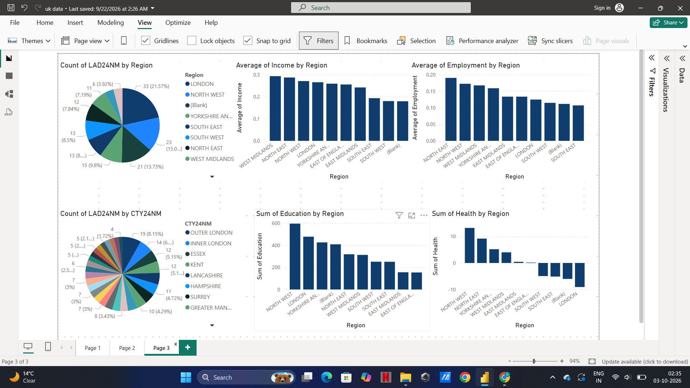
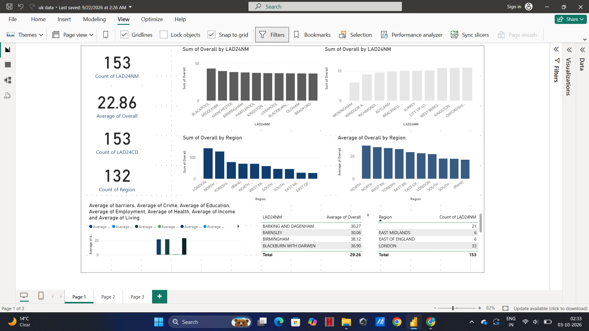

# UK Index of Multiple Deprivation 2025 Analysis

## Project Overview

This project analyses the UK Index of Multiple Deprivation (IMD) 2025 data using SQL and Power BI.

The project focuses on exploring deprivation patterns across local areas and analysing deprivation data using SQL queries, data preparation, data modelling, DAX, and Power BI visualizations.

The aim of the project is to transform the IMD 2025 data into meaningful insights and present the results through an interactive Power BI dashboard.

---

## Objectives

The main objectives of this project are:

- Explore and understand the IMD 2025 dataset
- Clean and prepare the data for analysis
- Use SQL to query and analyse the dataset
- Analyse deprivation across local authority areas
- Analyse geographical patterns in deprivation
- Use lookup data to support geographical analysis
- Identify areas with different levels of deprivation
- Create an interactive Power BI dashboard
- Present analytical findings through visualizations
- Develop practical SQL and Power BI data analysis skills

---

## Dataset

The project uses the following data sources:

- IMD 2025 dataset
- Local Authority District to Region lookup data
- Local Authority District to County lookup data

The geographical lookup data supports the analysis by providing additional information about local authority areas, regions, and counties.

---

## Tools and Technologies

The following tools and technologies were used:

- **SQL** — Data querying and analysis
- **Power BI** — Dashboard development and visualization
- **DAX** — Measures and calculations
- **Power Query** — Data preparation and transformation

---

## Data Preparation

The data was prepared before performing the analysis.

The main preparation steps included:

- Importing the IMD 2025 data
- Reviewing the dataset structure
- Checking data types
- Checking for missing and inconsistent values
- Preparing geographical lookup data
- Connecting local authority information with geographical information
- Preparing the data for SQL analysis
- Preparing the data model for Power BI

---

## SQL Analysis

SQL was used to explore and analyse the IMD 2025 data.

The analysis included:

- Filtering records
- Sorting data
- Grouping data
- Aggregating data
- Counting records
- Calculating summary statistics
- Analysing local authority areas
- Analysing geographical information
- Joining related datasets
- Comparing deprivation-related measures

---

## Power BI Dashboard

The prepared data was imported into Power BI to create an interactive dashboard.

The dashboard provides a visual overview of the IMD 2025 data and allows users to explore deprivation patterns across different geographical areas.

### Dashboard Features

The dashboard includes:

- Key performance indicators
- Deprivation analysis
- Local authority comparisons
- Regional analysis
- Geographical analysis
- Charts and tables
- Interactive filters
- Slicers

---

## Dashboard Screenshots

### Dashboard Overview

---

### Dashboard Analysis

---

### Dashboard Additional View

---

## Data Model

The Power BI model combines the main IMD dataset with geographical lookup information.

The relationships between the datasets allow the analysis to be performed across different geographical levels.

This supports analysis of deprivation across local authorities, regions, and counties.

---

## DAX

DAX was used to create calculations and measures required for the Power BI dashboard.

The measures support the analysis by providing calculated values and analytical metrics for the dashboard visualizations.

---

## Analysis Performed

The project explores a range of analytical questions, including:

- What are the different levels of deprivation across local areas?
- Which local authority areas have higher levels of deprivation?
- Which areas have lower levels of deprivation?
- How does deprivation vary across regions?
- How can local authorities be compared?
- How can geographical lookup data support deprivation analysis?
- What patterns can be identified from the IMD 2025 data?

---

## Project Workflow

The overall workflow for this project was:

1. Collect the IMD 2025 datasets
2. Review and understand the data
3. Prepare the datasets for analysis
4. Analyse the data using SQL
5. Prepare geographical lookup information
6. Load the data into Power BI
7. Build the data model
8. Create DAX calculations
9. Develop Power BI visualizations
10. Build the interactive dashboard
11. Analyse the results
12. Present the findings through the dashboard

---

## Skills Demonstrated

This project demonstrates the following skills:

- SQL
- Power BI
- DAX
- Power Query
- Data Cleaning
- Data Preparation
- Data Transformation
- Data Modelling
- SQL Joins
- Data Aggregation
- Data Filtering
- Geographical Data Analysis
- Data Visualization
- Dashboard Development
- Exploratory Data Analysis
- Analytical Thinking
- Data Storytelling

---

## Project Files

| File | Description |
|---|---|
| `UK-deprivation-analysis - 2025.sql` | SQL queries used for data analysis |
| `uk data.pbix` | Power BI dashboard |
| `imd-dashboard.png` | Dashboard screenshot |
| `imd-dashboard1.png` | Additional dashboard screenshot |
| `imd-dashboard2.png` | Additional dashboard screenshot |

---

## Project Outcome

This project provided practical experience in analysing deprivation data using SQL and Power BI.

The project demonstrates an end-to-end data analysis workflow, including data preparation, SQL analysis, data modelling, DAX calculations, visualization, and interactive dashboard development.

---

## Future Improvements

Possible future improvements include:

- Adding more detailed regional comparisons
- Adding historical IMD datasets for trend analysis
- Creating additional DAX measures
- Adding more geographical analysis
- Including additional socio-economic datasets
- Creating more advanced Power BI visualizations
- Expanding the analysis of individual deprivation domains

---

## Author

**Bhanu Karnam**
