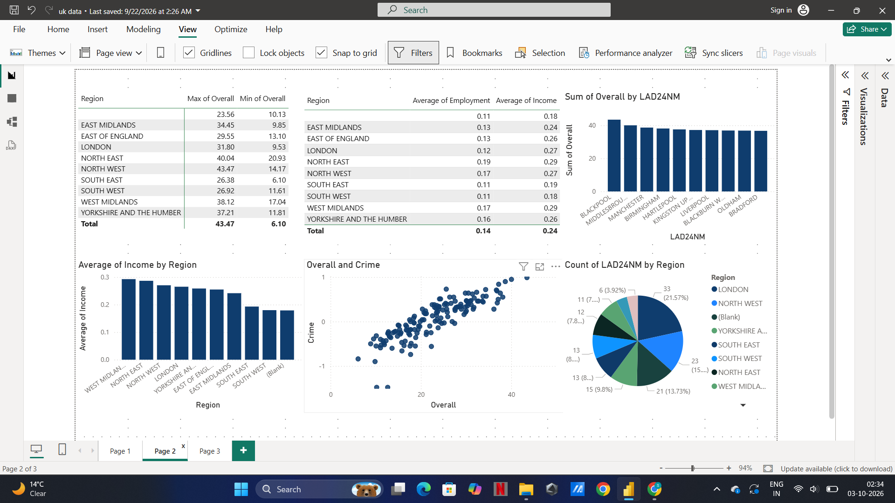

# UK Index of Multiple Deprivation 2025 Analysis

## Project Overview

This project analyses the Index of Multiple Deprivation (IMD) 2025 data for England using SQL and Power BI.

The analysis explores deprivation patterns across local authority areas and combines deprivation data with geographical information to support regional analysis and data visualisation.

## Tools Used

- SQL
- Power BI
- DAX

## Project Workflow

1. Imported and explored the IMD 2025 dataset
2. Cleaned and prepared the data using SQL
3. Analysed deprivation-related measures
4. Used geographical lookup data to support regional analysis
5. Built an interactive Power BI dashboard
6. Created visualisations to communicate the findings

## Power BI Dashboard

## Analysis

The dashboard provides analysis of:

- IMD 2025 deprivation measures
- Local authority areas
- Regional patterns
- County-level information
- Deprivation groupings
- Geographic distribution of deprivation

## Project Files

| File | Description |
|---|---|
| `imd_analysis.sql` | SQL queries used for data preparation and analysis |
| `imd_dashboard.pbix` | Power BI dashboard |
| `imd-dashboard.png` | Dashboard screenshot |

## Skills Demonstrated

- SQL data analysis
- Data cleaning and transformation
- Data modelling
- Power BI
- DAX
- Data visualisation
- Geographic data analysis
